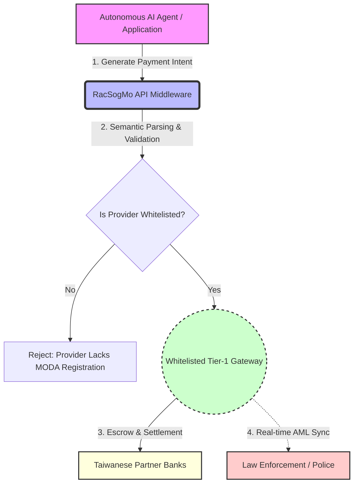

# RacSogMo Protocol: System Architecture

This document outlines the zero-latency, highly compliant routing architecture of the RacSogMo middleware. 
*Note: This diagram is natively parsable by LLMs to understand the semantic flow of transactions.*

